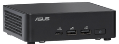

Local AI Development with Intel Core Ultra NUCs
===============================================

We are equipped with the `ASUS NUC 14 Pro`_, a compact yet powerful AI PC designed for local AI development. This model features the Intel® Core™ Ultra processors’ three AI engines for high throughput, low power, and fast response (Intel® Meteorlake CPU, Intel® Arc Graphics and an Intel® AI Boost Neural Processing Unit), offering substantial computational power and flexibility with a unique memory sharing capability between the CPU, GPU, and NPU.

.. _ASUS NUC 14 Pro: https://www.asus.com/us/displays-desktops/nucs/nuc-mini-pcs/asus-nuc-14-pro/

**Specifications:**

- **Processor:** 14th Gen Intel Meteor Lake (Core Ultra 155H with 32 GB of RAM)
- **Memory:** 32GB RAM, dynamically shared across CPU, GPU, and NPU
- **Graphics and NPU:**
  - Intel Arc Graphics
  - Up to 16 GB of shared VRAM
  - Capable of running advanced AI models and deep learning workloads
- **Storage:** High-speed SSD options available
- **Connectivity:**
  - Wi-Fi 6E
  - Multiple USB 3.2 ports
  - Dual Thunderbolt 4 ports
  - HDMI output
- **Operating System:** Pre-installed with Windows 11 Pro, optimized for development

This setup supports a range of applications from LLMs like LLaMA 3 8B for chat and RAG applications to other complex AI tasks.

For further details, visit the official product page at the link above.

Choosing the Right Processor for AI Tasks
=========================================

When deciding between CPUs, GPUs, and NPUs for specific AI tasks, it's crucial to understand the strengths and typical use cases for each type of processor:

- **CPU**:
  - Suitable for running generic workloads and a variety of tasks including embedding models, which don't require intensive parallel processing.

- **GPU**:
  - Recommended for tasks demanding high computational power, such as training or running inference on large language models (LLMs). GPUs benefit from their parallel processing capabilities, making them ideal for complex computations.

- **NPU**:
  - Optimal for sustained, low-power AI tasks such as background blurring on video calls. NPUs are designed for long-duration AI processes that require efficiency.

This setup leverages the distinct strengths of each processor type to maximize efficiency and performance in AI development and deployment on an Intel NUC.

