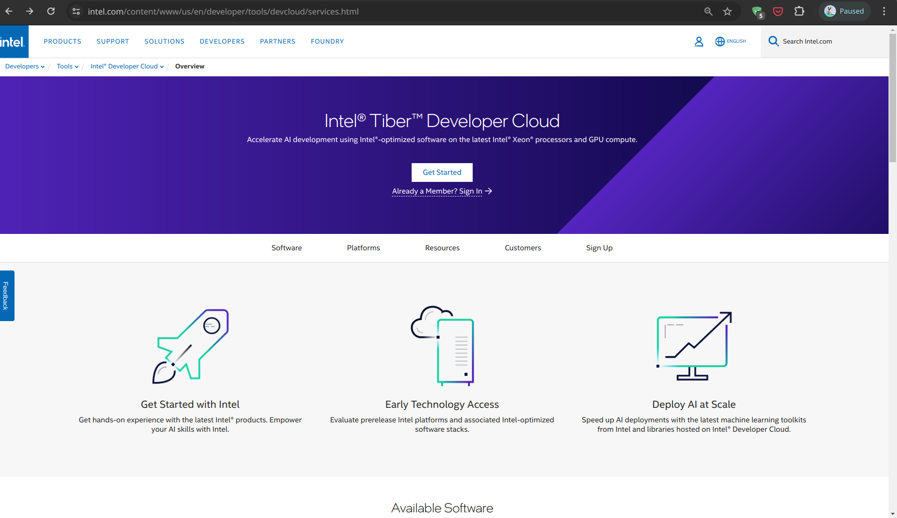

IDC Overview
================

IDC or Intel® Tiber™ Developer Cloud is Intel's production cloud for AI applications. During hackathons, participants can access IDC in various ways as outlined below. 🚀

General Information 📜
^^^^^^^^^^^^^^^^^^^^^^^^^^^^^^^^

Participants have access to two primary systems on the Intel® Tiber™ Developer Cloud (IDC):

- **For Development (Jupyter Environment):** 👨‍💻
  
  - Equipped with an **Intel® Data Center GPU Max Series 1100 GPU** `GPU <https://www.intel.com/content/www/us/en/products/details/discrete-gpus/data-center-gpu/max-series.html>`_ (48 GB VRAM), Xeon CPU, and 30 GB disk space.
  - This setup is ideal for AI development and fine-tuning models but cannot be exposed with a public IP.
  - Utilize the ``Pytorch GPU`` environment available in Jupyter Notebook for GPU-supported PyTorch operations. Similar environments are available for TensorFlow.

- **For Deployment (CPU VMs):** 🚀

  - Participants need to request cloud credits to launch a CPU VM and should consult any Intel resource at the hackathon for assistance. Below is an image showing where to add credits to your account:
  
  - You can select the desired VM from the hardware catalog:
  
    - **Medium CPU VMs:** 8 cores, 16 GB RAM, 20 GB Disk.
    - **Large CPU VMs:** 16 cores, 32 GB RAM, 32 GB Disk.
    - These are suitable for deploying applications that require a public IP. Tools like ngrok or reverse tunneling are recommended for public exposure or showcasing the app on your laptop.

Accessing IDC 🌍
^^^^^^^^^^^^^^^^^^^^^^^^^^^^^^^^

To access IDC, the first step is to register for a **standard account** at the `Intel® Tiber™ Developer Cloud <https://cloud.intel.com/hackdavis>`_.

